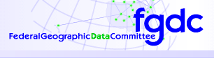
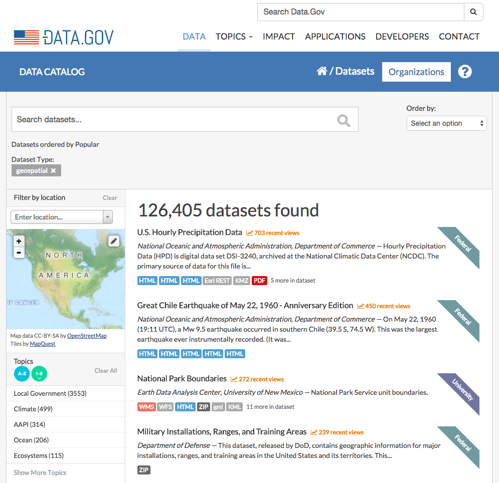

    from IPython.display import HTML
    from IPython.display import Image

    # from http://blog.nextgenetics.net/?e=102
    HTML('''
    The raw code for this IPython notebook is by default hidden for easier reading.
    To toggle on/off the raw code, click <a href="javascript:code_toggle()">here</a>.''')

The raw code for this IPython notebook is by default hidden for easier reading.
To toggle on/off the raw code, click <a href="javascript:code_toggle()">here</a>.

# Open Data: The Why and How of Contributing to and Benefitting from the Open Data Ecosystem

> *Karl Benedict* - Director of Research Data Services, College of University Libraries and Learning Sciences
>
> University of New Mexico
>
> kbene@unm.edu

## Presentation Outline

***

* Introduction
* Current Context
* A Quick Refresher on Geospatial Interoperability Standards
* Where & How You Can Get Stuff
* Where Your Stuff Can Go

***

## Introduction

***

* The Geospatial Community Has a Long Tradition of Open Data & Data Sharing

***

***

***

***

* Open standards to support geospatial data discovery, visualization and access

***

 - FGDC Content Standard for Digital Geospatial Metadata

***

 - ISO 19115/19115-2/19115-1 and related standards

***

 - Open Geospatial Consortium

## Current Context

***

***

## A Quick Refresher on Geospatial Interoperability Standards

***

***

    
